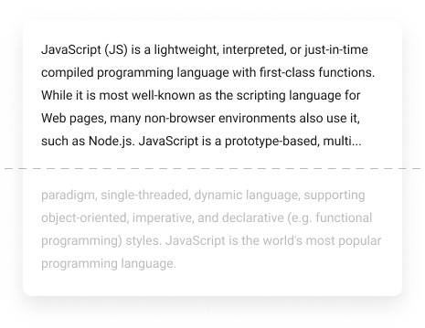

# js-snip

[](https://travis-ci.com/ajobi/js-snip)


[](http://standardjs.com)


Universal JavaScript library for clamping HTML text elements.

#### Key features:
* two snipping modes (CSS / JavaScript)
* no need to specify line heights
* re-snipping on element resize
* no dependencies



To get a hands-on experience try the [Interactive Demo](https://ajobi.github.io/js-snip/).

## Installation

```bash
# install with npm
npm install js-snip

# or with yarn
yarn add js-snip
```

## Core API

```typescript
export interface Snip {
  (element: HTMLElement, options?: Partial<Readonly<SnipOptions>>, onSnipped?: OnSnipped): void
}

export interface Unsnip {
  (element: HTMLElement): void
}
```

## Usage

```typescript
import { snip, unsnip } from 'js-snip'

// minimal example
snip(element)

// with options
snip(element, { lines: 3 })

// with several options
snip(element, { lines: 3, mode: 'js', midWord: false })

// with options and callback
snip(element, { lines: 3 }, (newState, oldState) => { 
  // ...
})

// unsnipping the element
unsnip(element)
```

## Options

```typescript
export interface SnipOptions {
  mode: 'css' | 'js'
  lines: number
  ellipsis: string
  midWord: boolean
}

// your options will get merged with the defaults
export const defaultOptions: Readonly<SnipOptions> = {
  mode: 'css',
  lines: 3,
  ellipsis: '.\u200A.\u200A.',
  midWord: true,
}
```

## State

Each snipped element has an internal state:

```typescript
export interface SnipState {
  hasEllipsis: boolean
}
```

## Callback
Callback will be executed immediately after the initial snipping and after each subsequent snipping (after resize etc.). It allows you to react to state changes:

```typescript
export interface OnSnipped {
  (newState: Readonly<SnipState>, oldState: Readonly<SnipState>): void
}
```

## How it works

- **CSS** mode is based on the `-webkit-line-clamp`.
- **JavaScript** mode is based on the progressive cutting of the element's `textContent` in a loop.

*Note: CSS mode is faster (preferred), but does not work in older browsers / in all situations (f.e. does not work in IE11, when you need the text to flow around a floated element, or when you want a custom ellipsis).*

### Caveats

For the library to be able to determine the number of lines / hide the text-overflow properly, the height of the element should be the same as the height of the text. Be wary of any CSS steps that will affect the height of the element. Some of the common examples:
* vertical paddings
* fixed height / fixed min-height
* making the element a flex-item (flex container's `align-items` defaults to `stretch`)
* making the element height grow with the `flex-grow` in the column flex layout.

*Note: You can still use the directive with flexbox, just make sure to change the default `align-items` / `align-self` value to `flex-start` or whatever fits your case.*

## IE11 Support

IE11 does not support `-webkit-line-clamp` (falls back to the JS mode), and the `ResizeObserver API`. This API needs to be polyfilled if you want to re-snip the elements on the resize in IE11 (they would still get snipped when inserted / on data change without the polyfill). Recommended: [@juggle/resize-observer](https://www.npmjs.com/package/@juggle/resize-observer)

``` javascript
import { ResizeObserver as Polyfill } from '@juggle/resize-observer';
 
window.ResizeObserver = window.ResizeObserver || Polyfill;
```

## Change Log
All changes are documented in the [change log](https://github.com/ajobi/js-snip/blob/master/CHANGELOG.md).
